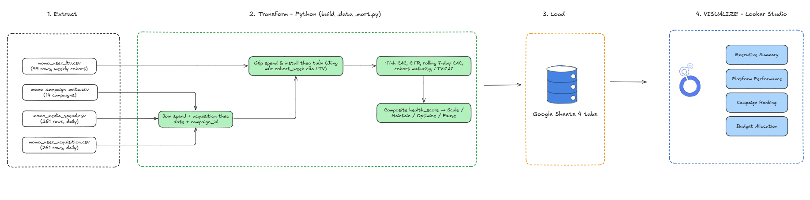
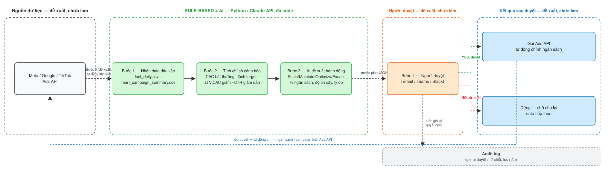

# Momo Media — Data Analytics Engineer Assessment

Bài assessment cho vai trò **Data Analytics Engineer** hỗ trợ Momo Media, gồm 2 phần: (1) xây data mart + dashboard từ dữ liệu chiến dịch quảng cáo, và (2) prototype tự động hóa đề xuất media plan bằng AI.

- 🔗 **Live dashboard (Task 1)**: https://datastudio.google.com/reporting/3269670d-ed80-401d-9c98-f14f58837104

---

## 📊 Task 1 — Data Mart & Looker Studio Dashboard

Pipeline Python (pandas) transform 4 file CSV thô (`Momo Test Data/`) thành 4 bảng data mart sạch, đổ lên Google Sheets, rồi build dashboard trên Looker Studio.



**Điểm khác biệt hóa chính**:
- **Granularity mismatch**: `momo_user_ltv.csv` ở grain **tuần** (cohort), còn spend/acquisition ở grain **ngày** — xử lý bằng cách gộp daily data thành bucket 7-ngày đúng mốc `cohort_week` trước khi join, thay vì blend thẳng 4 CSV (dễ join sai/mất data LTV).
- **Cohort immaturity guardrail**: data chỉ trải dài ~63 ngày nên không cohort nào đủ tuổi có D90 thật. `best_ltv_window` chỉ lấy window đã thực sự "chín" (COALESCE D90→D30→D7→D1), và `recommended_action` không bao giờ đề xuất *Scale* nếu thiếu bằng chứng LTV chín — tránh quyết định dựa trên số liệu rỗng/giả.
- **Time-based rolling window**: dữ liệu "daily" thực chất lấy mẫu thưa và giãn dần (1→9 ngày/lần đo), nên `rolling_7d_cac` dùng rolling theo **7 ngày lịch thực** thay vì 7 dòng dữ liệu.

### Output
| File | Nội dung |
|---|---|
| `output/dim_campaign.csv` | Dimension — 14 campaign, platform, ngân sách, target CAC |
| `output/fact_daily.csv` | Fact theo ngày × campaign — spend, install, CAC, CTR, rolling 7d CAC |
| `output/fact_weekly_cohort.csv` | Fact theo tuần × campaign — nối đúng grain với LTV cohort |
| `output/mart_campaign_summary.csv` | 1 dòng/campaign — health_score, recommended_action, dùng cho toàn dashboard |

---

## 🤖 Task 2 — AI-Powered Media Planning Automation

Prototype đọc trực tiếp output của Task 1 (`fact_daily`, `mart_campaign_summary`), tính tín hiệu hiệu suất bằng rule-based logic, rồi gọi Claude API (structured output) để sinh đề xuất media plan.



*Vùng viền xanh lá (Rule-based + AI) = đã code, chạy thật trên data thật. Các vùng còn lại (nguồn dữ liệu, người duyệt, kết quả sau duyệt) = mới là đề xuất kiến trúc, cố ý chưa code trong phạm vi thời gian assessment — cần hạ tầng/credentials thật (Slack/Email, Ads API) và cơ chế duyệt đúng cách trước khi tự động chỉnh ngân sách thật. Nếu bị từ chối (NO), hệ thống dừng hẳn và ghi log — không tự động lặp lại vì data đầu vào chưa đổi.*

### Chạy thử
```bash
pip install pandas numpy anthropic

# Mock mode (mặc định, không cần API key) — deterministic rule-based stand-in cho phần LLM
python scripts/ai_media_planner.py

# Live mode — gọi Claude API thật
export ANTHROPIC_API_KEY=xxx
python scripts/ai_media_planner.py
```
Output: `output/ai_media_plan.json`.

---

## 🗂️ Cấu trúc thư mục

```
.
├── Momo Test Data/            # 4 file CSV gốc đề bài cung cấp
│   ├── momo_campaign_meta.csv
│   ├── momo_media_spend.csv
│   ├── momo_user_acquisition.csv
│   └── momo_user_ltv.csv
├── scripts/
│   ├── build_data_mart.py     # Task 1 — ETL: 4 CSV thô → 4 data mart
│   └── ai_media_planner.py    # Task 2 — rule-based signals + Claude API
├── output/                    # Data mart + media plan output (generated)
└── README.md
```

## ⚙️ Cách chạy toàn bộ pipeline

```bash
pip install pandas numpy anthropic

# Task 1 — build data mart
python scripts/build_data_mart.py
# → output/dim_campaign.csv, fact_daily.csv, fact_weekly_cohort.csv, mart_campaign_summary.csv
# (upload thủ công 4 file này lên Google Sheets làm data source cho Looker Studio)

# Task 2 — AI media plan
python scripts/ai_media_planner.py
# → output/ai_media_plan.json
```
